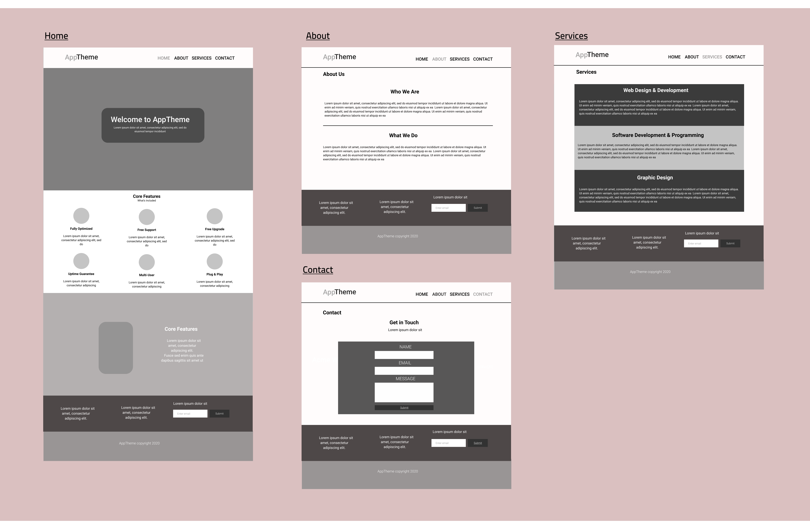

# Development Strategy

> `app-theme`

Following the tutorial provided we have to rebuild a website containing 4 pages, each on a branch. For every branch we need to create a pull request to the master and merge it later with the master. The foundation and preliminary preparation of this exercise consists of writing and developing a clean development strategy and creating a wireframe. This time we will use the [FlexBox CSS Layout](https://css-tricks.com/snippets/css/a-guide-to-flexbox/) to build a a responsive HTML template. To help us we will use a CSS frmework called [Flexboxgrid](http://flexboxgrid.com/) built using Flexbox. Flexboxgrid adopts a system similar to the grid system used in Bootstrap.

[GO TO THE README](README.md)

- who would want to use it?  

This is a starter project for a beginner, it covers the CSS Flexbox Layout. We learn how to work with branches, how to develop a strategy to build this and future projects.

- why would they want to use it?  

CSS Flexbox is a new way to create layouts using HTML and CSS efficiently, better than using float properties. [Six reasons to start using Flexbox](https://bitsofco.de/6-reasons-to-start-using-flexbox/)

## Wireframe

<!-- include a wireframe for your project in this repository, and display it here -->
<!-- wireframe.cc is a good site for getting started with wireframes -->
   

---

## 0 Set-Up:
* Read the text of the assignment
* follow the tutorial step by step

### Repo

1. On Github Generate Repo from Template
1. Write initial, basic README
1. Write initial, basic development strategy
1. Turn on GitHub Pages (https://bermarte.github.io/acme-web-design/)
1. Clone this repo locally
1. Edit your development strategy locally
1. Add, commit, push on GitHub server your development strategy
1. Download the code to copy the images and the CSS framework

### Steps to follow (general overview)

1. locally, make a new branch  
   `git branch branch_name`
2. Switch to the new branch  
  `git checkout branch_name`   
   copy the files for that branch and add the HYF template to check the code later   
3. Add the branch_file to your local repository (Staging)  
   `git add file_name`
4. Commit the changes  
  `git commit -m " message"`
6. Switch to the master branch  
  `git checkout master`
7. Repeat 1. to 6. for every branch   
8. On your client, chekout one branch at the time   
 `git checkout branch_name`
9. Push it to this repository creating the branch on the server     
 `git push --set-upstream origin branch_name`
10. Compare, create a pull request on GitHub, write a message, merge and confirm. Then on your local repo, checkout master and pull
11. Repeat 8. to 10. for every branch
12. On GitHub, after every merge, continue writing the Development strategy (this file) 
13. Using githubpages, validate and debug the html files, the CSS and the rest using the template of HYF
14. Pull master to local
15. Fix the errors found at 13. on your local computer
16. Once finished push the changes to the server

 ### Branches

what branch(es) did you work on?

- master 
- imgs
- css
- index  
- about  
- services

### HTML

what did you change in the HTML and why?
* ...

### CSS
what did you change in the HTML and why?
* ...   

---

## 1. User Story: COPY THE IMAGES 

* Create locally the branch images   
`git branch images`
* switch to the branch
`git checkout images`
* Copy the images folder, stage it and commit
* Push the branch to GitHub and create the same branch online   
`git push origin images`   
* Write the step in the Development strategy using Github and save it (stage it and commit: 'write step 1 in development strategy')
* Pull request, merge images branch in the master branch
* checkout master and pull locally   

### Branches

1. This user story was developed on a brach called `images`
2. It was merged into `master` when the feature was finished

## 2. User Story: COPY THE FLEXBOXGRID CSS
* Write this step in the devlopment strategy (then stage, commit and push)
* From master, crete locally the branch css
`git branch css`
* Switch to the css branch
`git checkout css`
* Copy the flexbox css file inside the css folder, stage the changes and commit
* Push the branch to GitHub and create the same branch online   
`git push origin css`
* Pull request, merge css branch in the master branch (in GitHub)
* checkout master and pull locally   

---

## 3. User Story: CREATE INDEX HTML   

Creating the basic layout for the index file, you are in the master branch

* Create a custom style.css inside the css folder
* Add, Commit, Push

### Branches

1. This user story was developed on a brach called `index`
2. It was merged into `master` when the feature was finished  

### HTML

* Basic HTML structure
* Header and nav
* Showcase section
* Feature section
* Info section
* Company section
* Footer

### CSS

* Create style.css in the css folder
* Style the div container and the image element
* Copy font-awesome.css in the same directory
* Copy the font directory provided in the tutorial

---

## 4. User Story: CREATE ABOUT HTML   

Creating about file in the branch about

### Branches

1. This user story was developed on a brach called `about`
2. It was merged into `master` when the feature was finished  

### HTML

* Copy the content of index.html in about.html
* Remove sections showcase, feature and info
* Edit the file moving the current class and changing the title
* Add the sub-header
* Add section page

### CSS

nothing done

---

## 5. User Story: CREATE SERVICES HTML   

Creating about file in the branch services

### Branches

1. This user story was developed on a brach called `services`
2. It was merged into `master` when the feature was finished  

### HTML

* Copy the content of about.html in services.html
* Remove text inside the page section
* Adapt the content
* Add 'We Offer'

### CSS

nothing done

---

## 6. User Story: CREATE CONTACT HTML   

Creating about file in the branch contact

### Branches

1. This user story was developed on a brach called `contact`
2. It was merged into `master` when the feature was finished  

### HTML

* Copy the content of service.html in contact.html
* Edit contact.html, move the current class
* Change the header of the subheader
* Change the class of the section page to 'contact'
* Keep the h2 and remove the ul
* Change the text of the h2 to 'get in touch'
* Add a paragraph and a contact form'

### CSS

nothing done

---

## 7. User Story: CSS STYLE 

* Style all the pages  

### Branches

1. This user story was developed on a brach called `master`

### HTML

* Fix about.html
* Fix contact.html
* Fix services.html
* Fix index.html

### CSS

Work on css/style.css

* Complete the tutorial
* Complete CSS, style and check everything
* Add media queries
